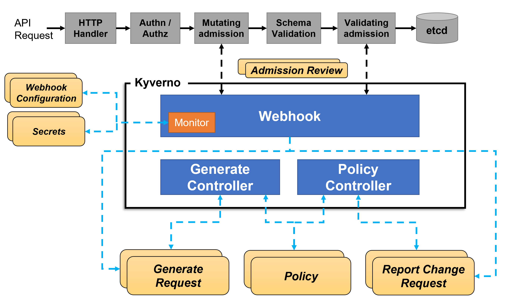
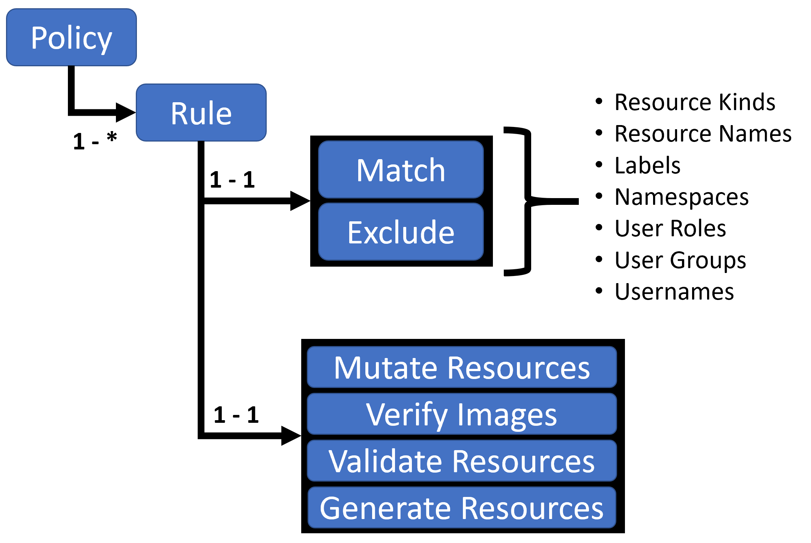

# Kyverno

OPA 的 Gatekeeper 以及 Kyverno 是 CNCF 的两个头部策略管理项目，两个产品各有千秋，前面我们已经学习了 Gatekeeper，接下来我们就来了解下如何使用 Kyverno。


Kyverno 是来自 Nirmata 的开源项目，后来也捐赠给了 CNCF。和 Gatekeeper一样，Kyverno 也是一个具有验证和变异能力的 Kubernetes 策略引擎，但是它还有生成资源的功能，最近还加入了 API 对象查询的能力。与 Gatekeeper 不同，Kyverno 原本就是为 Kubernetes 编写的。和 Gatekeeper 相比，Kyverno 除了对象生成功能之外，还无需专用语言即可编写策略，从实现语言的角度上来看，Kyverno 的模型更为简洁。毕竟 Gatekeeper 的 Rego 语言有一定的门槛。

同样 Kyverno 在 Kubernetes 集群中也是作为动态准入控制器运行的。Kyverno 从 kube-apiserver 接收验证和修改准入 webhook HTTP 回调，并应用匹配策略返回执行准入策略或拒绝请求的结果。Kyverno 策略可以使用资源 Kind、name 和标签选择器匹配资源，而且名称中支持通配符。

策略执行是通过 Kubernetes events 来捕获的，Kyverno 还报告现有资源的策略违规行为。下图显示了 Kyverno 的整体架构：



Kyverno 的高可用安装可以通过运行多个副本来完成，并且 Kyverno 的每个副本将具有多个执行不同功能的控制器。Webhook 处理来自 Kubernetes APIServer 的 AdmissionReview 请求，其 Monitor 组件创建和管理所需的配置。PolicyController watch 策略资源并根据配置的扫描间隔启动后台扫描，GenerateController 管理生成资源的生命周期。

## 对比

由于 Gatekeeper 与 Kyverno 都是策略管理的项目，所以自然我们要对这两个项目的优劣势做一个对比。

=== "Gatekeeper 的优势"
	- 能够表达非常复杂的策略；
	- 社区更为成熟；
	- 支持多副本模式，更好的可用性和伸缩性。

=== "Gatekeeper 的劣势"
	- 需要编程语言支持，该语言的学习曲线较为陡峭，可能会产生大量技术债，并延长交付时间；
	- 没有生成能力，意味着它的主要应用场景就在验证方面；
	- 策略复杂冗长，需要多个对象协同实现。
	
=== "Kyverno 的优势"
	- Kubernetes 风格的策略表达方式，非常易于编写；
	- 成熟的变异能力；
	- 独特的生成和同步能力，扩展了应用场景；
	- 快速交付，场景丰富。
	
=== "Kyverno 的劣势"
	- 受到语言能力的限制，难以实现复杂策略；
	- 较为年轻，社区接受度不高；
	- API 对象查询能力还很初级；

从上面对比可以看出来 Gatekeeper 最大的弱点是它需要 Rego 这门语言来实现策略逻辑，而这种语言在其他地方都无法使用，这也大大增加了门槛，当然同样这也是一种优势，因为编程语言可以实现非常强大的逻辑。相比 Gatekeeper 来说，Kyverno 的第一印象就是没有那么复杂的技术需求，因为它是专门为 Kubernetes 构建的，并且用声明式的方法来表达策略，所以它的模型与 Kubernetes 对象的描述和协调方式是相同的，这种模式导致策略的编写方式得到了极大的简化，全面的降低了策略引擎的使用难度。此外 Kyverno 的编译和生成能力，使它从一个简单的准入控制器转变为一个真正的自动化工具。通过结合这三种能力，再加上最近增加的 API 查询能力，Kyverno 能够执行 Gatekeeper 所不能执行的任务。这种简单性加上它的自动化能力和对其他工具的整合，为新用户以及有经验的用户和操作者带来了巨大的价值。

当然具体选择哪一个工具，还是应该根据自己的需求和限制条件进行评估，但是有一点是所有生产环境的用户都应该计划使用策略引擎来保护集群的安全并简化 Kubernetes 管理。

## 安装

你可以选择直接从最新版本的资源清单安装 Kyverno，直接执行下面的命令即可：

```shell
➜ kubectl create -f https://raw.githubusercontent.com/kyverno/kyverno/main/config/install.yaml
```

此外同样可以使用 Helm 来进行一键安装：

```shell
➜ helm repo add kyverno https://kyverno.github.io/kyverno/
➜ helm repo update
# Install the Kyverno Helm chart into a new namespace called "kyverno"
➜ helm install kyverno kyverno/kyverno -n kyverno --create-namespace
```

安装完成会创建一个 kyverno 命名空间，同样也包含一些相关的 CRD：

```shell
➜ kubectl get pods -n kyverno
NAME                       READY   STATUS    RESTARTS   AGE
kyverno-69bdfcfc7c-dbtlt   1/1     Running   0          29m
➜ kubectl get validatingwebhookconfiguration
NAME                                      WEBHOOKS   AGE
kyverno-policy-validating-webhook-cfg     1          14m
kyverno-resource-validating-webhook-cfg   2          14m
➜ kubectl get mutatingwebhookconfigurations
NAME                                    WEBHOOKS   AGE
kyverno-policy-mutating-webhook-cfg     1          14m
kyverno-resource-mutating-webhook-cfg   2          14m
kyverno-verify-mutating-webhook-cfg     1          14m
➜ kubectl get crd |grep kyverno
clusterpolicies.kyverno.io               2022-03-29T07:21:22Z
clusterreportchangerequests.kyverno.io   2022-03-29T07:21:22Z
generaterequests.kyverno.io              2022-03-29T07:21:22Z
policies.kyverno.io                      2022-03-29T07:21:22Z
reportchangerequests.kyverno.io          2022-03-29T07:21:23Z
```

可以看出安装完成后创建了几个 validatingwebhookconfiguration 与 mutatingwebhookconfigurations 对象。

## 策略与规则

使用 Kyverno 其实就是对策略和规则的应用，Kyverno 策略是规则的集合，每个规则都包含一个 match 声明、一个可选的 exclude 声明以及 validate、mutate、generate 或 verifyImages 声明之一组成，每个规则只能包含一个 validate、mutate、generate 或 verifyImages 子声明。



策略可以定义为集群范围的资源（ClusterPolicy）或命名空间级别资源（Policy）。

- Policy 将仅适用于定义它们的 namespace 内的资源
- ClusterPolicy 应用于匹配跨所有 namespace 的资源

## 策略定义

编写策略其实就是定义 Policy 或者 ClusterPolicy 对象。

### 验证资源

验证规则基本上是我们使用最常见和最实用的规则类型，当用户或进程创建新资源时，Kyverno 将根据验证规则检查该资源的属性，如果验证通过，则允许创建资源。如果验证失败，则创建被阻止。比如现在我们添加一个策略，要求所有的 pod 都包含一个 kyverno 的标签：

```yaml
# kyverno-require-label.yaml
apiVersion: kyverno.io/v1
kind: ClusterPolicy
metadata:
  name: require-label
spec:
  validationFailureAction: enforce
  rules:
  - name: check-for-labels
    match:
      resources:
        kinds:
        - Pod
    validate:
      message: "label 'kyverno' is required"
      pattern:
        metadata:
          labels:
            kyverno: "?*"
```

上面策略文件中添加了一个 validationFailureAction=[audit, enforce] 属性：

- 当处于 audit 模式下 ，每当创建违反规则集的一个或多个规则的资源时，会允许 admission review 请求，并将结果添加到报告中。
- 当处于 enforce 模式下 ，资源在创建时立即被阻止，报告中不会有。

然后就是下面使用 rules 属性定义的规则集合，match 用于表示匹配的资源资源，validate 表示验证方式，这里我们定义 `kyverno: "?*"` 这样的标签表示必须有这样的一个标签 key。

直接应用上面的策略对象即可：            

```shell
➜ kubectl apply -f kyverno-require-label.yaml
clusterpolicy.kyverno.io/require-label created
➜ kubectl get clusterpolicy
NAME            BACKGROUND   ACTION    READY
require-label   true         enforce   true
```

现在我们添加一个不带标签 kyverno 的 Pod：

```shell
➜ kubectl run busybox --image=busybox:1.28.4  --restart=Never -- sleep 1000000
Error from server: admission webhook "validate.kyverno.svc-fail" denied the request:

resource Pod/default/busybox was blocked due to the following policies

require-label:
  check-for-labels: 'validation error: label ''kyverno'' is required. Rule check-for-labels
    failed at path /metadata/labels/kyverno/'
```

可以看到提示，需要一个 kyverno 标签，同样我们也可以通过查看 Events 事件来了解策略应用情况：

```shell
➜ kubectl get events -A -w
......
metallb-system    9m25s       Warning   PolicyViolation     daemonset/speaker                      policy 'require-label' (Validation) rule 'autogen-check-for-labels' failed. validation error: label 'kyverno' is required. Rule autogen-check-for-labels failed at path /spec/template/metadata/labels/kyverno/
default           0s          Warning   PolicyViolation     clusterpolicy/require-label            Rule(s) 'check-for-labels' failed to apply on resource Pod/default/busybox
```

如果创建的 Pod 带有 kyverno 标签则可以正常创建：

```shell
➜ kubectl run busybox --image=busybox:1.28.4 --labels kyverno=demo --restart=Never -- sleep 1000000
pod/busybox created
```

如果将 validationFailureAction 的值更改为 audit，则即使我们创建的 Pod 不带有 kyverno 标签，也可以创建成功，但是我们可以在 PolicyReport 对象中看到对应的违规报告：

```yaml
➜ kubectl get policyreports
NAME              PASS   FAIL   WARN   ERROR   SKIP   AGE
polr-ns-default   0      2      0      0       0      20m
➜ kubectl describe policyreports |grep "Result: \+fail" -B10
  UID:               90d1dfc7-0e42-4133-8a65-4bbf559533a2
Results:
  Message:  validation error: label 'kyverno' is required. Rule autogen-check-for-labels failed at path /spec/template/metadata/labels/kyverno/
  Policy:   require-label
  Resources:
    API Version:  apps/v1
    Kind:         Deployment
    Name:         minio
    Namespace:    default
    UID:          86ccd8fc-07f6-47a4-a9ed-b9dec665dff3
  Result:         fail
--
    Nanos:    0
    Seconds:  1648541980
  Message:    validation error: label 'kyverno' is required. Rule check-for-labels failed at path /metadata/labels/kyverno/
  Policy:     require-label
  Resources:
    API Version:  v1
    Kind:         Pod
    Name:         busybox
    Namespace:    default
    UID:          7e593177-4366-462b-81cf-1057657ae099
  Result:         fail
```

从上面的报告资源中可以看到违反策略的资源对象。

变更规则

变更规则可以用于修改匹配到规则的资源（比如规则设置了 metadata 字段可以和资源的 metadata 进行合并），就是根据我们设置的规则来修改对应的资源。

比如现在我们添加如下所示一个策略，给所有包含 nginx 镜像 的 pod 都加上一个标签（kyverno=nginx）：

```yaml
# kyverno-mutate-label.yaml
apiVersion: kyverno.io/v1
kind: ClusterPolicy
metadata:
  name: nginx-label
spec:
  rules:
    - name: nginx-label
      match:
        resources:
          kinds:
          - Pod
      mutate:
        patchStrategicMerge:
          metadata:
            labels:
              kyverno: nginx
          spec:
            (containers):
            - (image): "*nginx*"  # 容器镜像包含 nginx 即可
```

直接应用上面这个策略对象即可：

```shell
➜ kubectl apply -f kyverno-mutate-label.yaml
clusterpolicy.kyverno.io/nginx-label created
➜ kubectl get clusterpolicy
NAME            BACKGROUND   ACTION    READY
nginx-label     true         audit     true
require-label   true         enforce   true
```

现在我们使用 nginx 镜像直接创建一个 Pod：

```shell
➜ kubectl run --image=nginx nginx
pod/nginx created
➜ kubectl get pod nginx --show-labels
NAME    READY   STATUS    RESTARTS   AGE   LABELS
nginx   1/1     Running   0          29s   kyverno=nginx,run=nginx
```

可以看到 Pod 创建成功后包含了一个 kyverno=nginx 标签，由于有 kyverno 标签，所以上面的验证策略也是通过的，可以正常创建。

### 生成资源

生成规则可用于在创建新资源或更新源时创建其他资源，例如为命名空间创建新 RoleBindings 或 Secret 等。

比如现在我们一个需求是将某个 Secret 同步到其他命名空间中去（比如 TLS 密钥、镜像仓库认证信息），手动复制这些 Secret 比较麻烦，则我们可以使用 Kyverno 来创建一个策略帮助我们同步这些 Secret。比如在 default 命名空间中有一个名为 regcred 的 Secret 对象，需要复制到另外的命名空间，如果源 Secret 发生更改，它还将向复制的 Secret 同步更新。

```yaml
# kyverno-generate-secret.yaml
apiVersion: kyverno.io/v1
kind: ClusterPolicy
metadata:
  name: sync-secrets
spec:
  rules:
  - name: sync-image-pull-secret
    match:
      resources:
        kinds:
        - Namespace
    generate:  # 生成的资源对象
      kind: Secret
      name: regcred
      namespace: "{{request.object.metadata.name}}"  # 获取目标命名空间
      synchronize: true
      clone:
        namespace: default
        name: regcred
```

先在 default 命名空间中准备我们的 Secret 对象：

```shell
➜ kubectl create secret docker-registry regcred --docker-server=DOCKER_REGISTRY_SERVER --docker-username=DOCKER_USER --docker-password=DOCKER_PASSWORD --docker-email=DOCKER_EMAIL
secret/regcred created
```

然后应用上面的同步 Secret 策略：

```shell
➜ kubectl apply -f kyverno-generate-secret.yaml
clusterpolicy.kyverno.io/sync-secrets created
➜ kubectl get clusterpolicy
NAME            BACKGROUND   ACTION    READY
nginx-label     true         audit     true
require-label   true         enforce   true
sync-secrets    true         audit     true
```

现在我们创建一个新的命名空间：

```shell
➜ kubectl create ns test
namespace/test created
➜ kubectl get secret -n test
NAME                  TYPE                                  DATA   AGE
default-token-7b7cv   kubernetes.io/service-account-token   3      7s
regcred               kubernetes.io/dockerconfigjson        1      6s
```

可以看到在新建的命名空间中多了一个 regcred 的 Secret 对象。

更多的 Kyverno 策略可以直接查看官方网站：https://kyverno.io/policies，可以在该网站上面根据策略类型、分类、主题等进行筛选。Kyverno 在灵活、强大和易用之间取得了一个很好的平衡，不需要太多学习时间，就能够提供相当方便的功能，官网提供了大量的针对各种场景的样例，非常值得使用。        
