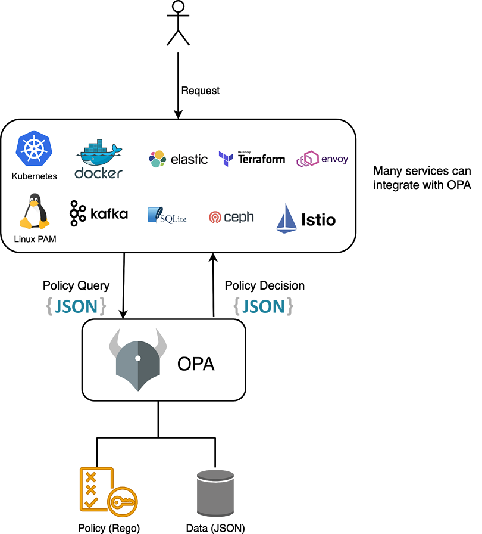
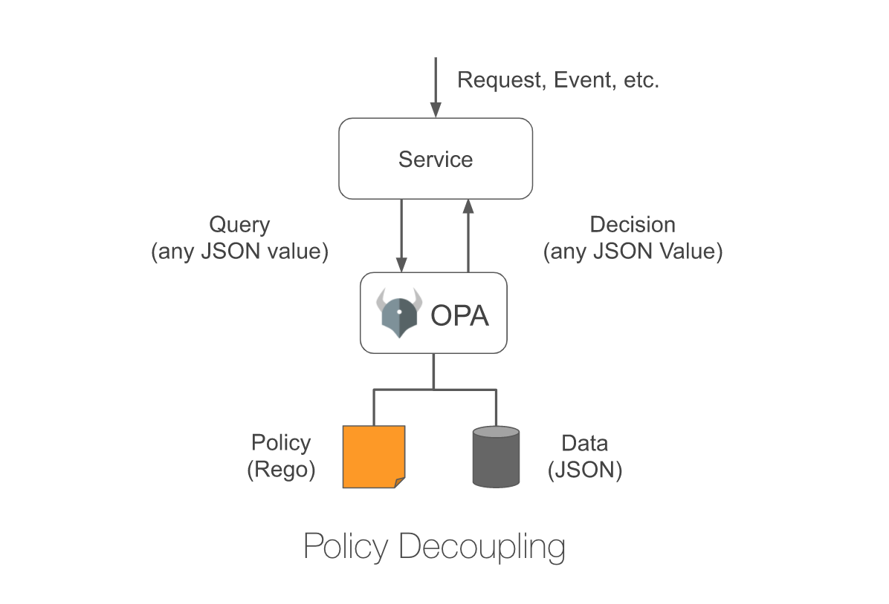
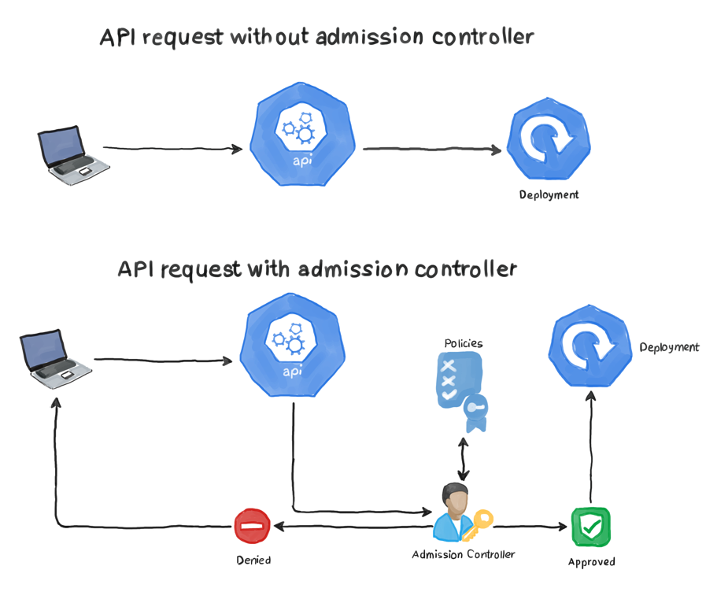
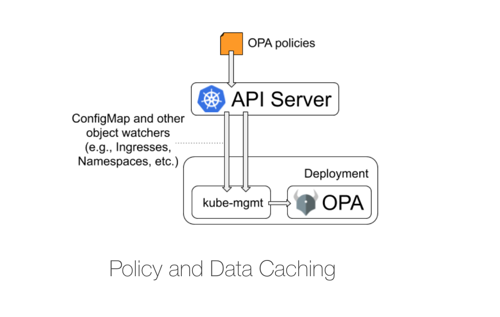
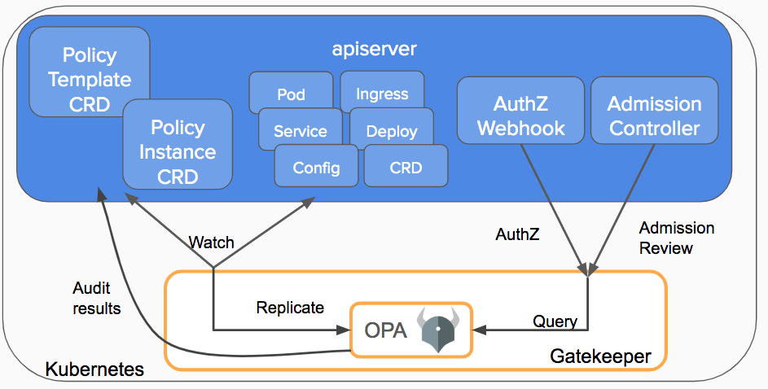
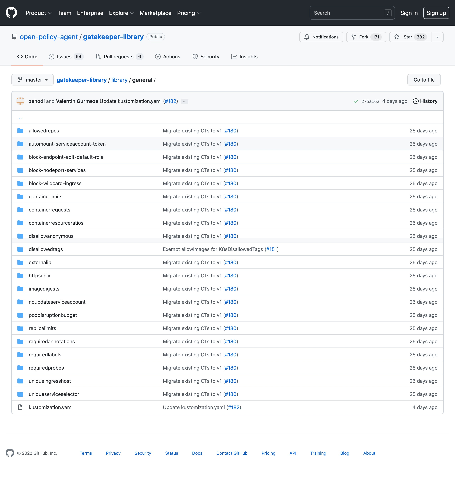

# OPA 策略引擎

Open Policy Agent 简称 OPA，是一种开源的通用策略代理引擎，是 CNCF 毕业的项目。OPA 提供了一种高级声明式语言 Rego，简化了策略规则的定义，以减轻程序中策略的决策负担。在微服务、Kubernetes、CI/CD、API 网关等场景中均可以使用 OPA 来定义策略。



我们这里主要讲解在 Kubernetes 中如何集成 OPA，在 Kubernetes 中 OPA 是通过 Admission Controllers 来实现安全策略的。事实上使用 Pod 安全策略（要废弃了）来执行我们的安全策略并没有什么问题，然而，根据定义，PSP 只能应用于 pods。它们不能处理其他 Kubernetes 资源，如 Ingresses、Deployments、Services 等，OPA 的强大之处在于它可以应用于任何 Kubernetes 资源。OPA 作为一个准入控制器部署到 Kubernetes，它拦截发送到 APIServer 的 API 调用，并验证和/或修改它们。你可以有一个统一的 OPA 策略，适用于系统的不同组件，而不仅仅是 pods，例如，有一种策略，强制用户在其服务中使用公司的域，并确保用户只从公司的镜像仓库中拉取镜像。

## 概述

OPA 将策略决策与策略执行分离，当应用需要做出策略决策时，它会查询 OPA 并提供结构化数据（例如 JSON）作为输入，OPA 接受任意结构化数据作为输入。



OPA 通过评估查询输入策略和数据来生成策略决策，你可以在你的策略中描述几乎任何的不变因素，例如：

- 哪些用户可以访问哪些资源
- 哪些子网的出口流量被允许
- 工作负载必须部署到哪些集群
- 二进制文件可以从哪里下载
- 容器可以用哪些操作系统的能力来执行
- 系统在一天中的哪些时间可以被访问

策略决定不限于简单的是/否或允许/拒绝，与查询输入一样，你的策略可以生成任意结构化数据作为输出。 让我们看一个例子。OPA 的策略是用一种叫做 Rego 的高级声明性语言来声明的，Rego 是专门为表达复杂的分层数据结构的策略而设计的。

在 Kubernetes 中，准入控制器在创建、更新和删除操作期间对对象实施策略。准入控制是 Kubernetes 中策略执行的基础。通过将 OPA 部署为准入控制器，可以：

- 要求在所有资源上使用特定标签
- 要求容器镜像来自企业镜像仓库
- 要求所有 Pod 指定资源请求和限制
- 防止创建冲突的 Ingress 对象
- ......

Kubernetes APIServer 配置为在创建、更新或删除对象时查询 OPA 以获取准入控制策略。APIServer 将 webhook 请求中的整个对象发送给 OPA，OPA 使用准入审查作为输入来评估它已加载的策略。这个其实和我们自己去实现一个准入控制器是类似的，只是不需要我们去编写代码，只需要编写策略规则，OPA 就可以根据我们的规则去对输入的对象进行验证。

## 部署

接下来我们介绍下如何在 Kubernetes 集群中集成 OPA，由于 Kubernetes 中是通过准入控制器来集成 OPA 的，所以我们必须在集群中启用 ValidatingAdmissionWebhook 这个准入控制器。



首先创建一个名为 opa 的命名空间，可以让 OPA 从该命名空间中的 ConfigMap 去加载策略：

```shell
➜ kubectl create namespace opa
```

并将上下文更改为 opa 命名空间：

```shell
➜ kubectl config current-context
kubernetes-admin@kubernetes
➜ kubectl config set-context kubernetes-admin@kubernetes --namespace=opa
Context "kubernetes-admin@kubernetes" modified.
➜ kubectl get pods
No resources found in opa namespace.
```

为了保护 APIServer 和 OPA 之间的通信，我们需要配置 TLS 证书。

1. 创建证书颁发机构和密钥：

```shell
➜ openssl genrsa -out ca.key 2048
➜ openssl req -x509 -new -nodes -key ca.key -days 100000 -out ca.crt -subj "/CN=admission_ca"
```

2. 为 OPA 生成密钥和证书：

```shell
cat >server.conf <<EOF
[req]
req_extensions = v3_req
distinguished_name = req_distinguished_name
[req_distinguished_name]
[ v3_req ]
basicConstraints = CA:FALSE
keyUsage = nonRepudiation, digitalSignature, keyEncipherment
extendedKeyUsage = clientAuth, serverAuth
subjectAltName = @alt_names
[ alt_names ]
DNS.1 = opa.opa.svc
EOF
➜ openssl genrsa -out server.key 2048
➜ openssl req -new -key server.key -out server.csr -subj "/CN=opa.opa.svc" -config server.conf
➜ openssl x509 -req -in server.csr -CA ca.crt -CAkey ca.key -CAcreateserial -out server.crt -days 100000 -extensions v3_req -extfile server.conf
```

3. 创建一个 Kubernetes TLS Secret 来存储我们的 OPA 凭证：

```shell
➜ kubectl create secret tls opa-server --cert=server.crt --key=server.key
```

证书准备好后就可以部署准入控制器了，对应的资源清单文件如下所示：

```yaml
# opa-admission-controller.yaml
# Grant OPA/kube-mgmt read-only access to resources. This lets kube-mgmt
# replicate resources into OPA so they can be used in policies.
kind: ClusterRoleBinding
apiVersion: rbac.authorization.k8s.io/v1
metadata:
  name: opa-viewer
roleRef:
  kind: ClusterRole
  name: view
  apiGroup: rbac.authorization.k8s.io
subjects:
- kind: Group
  name: system:serviceaccounts:opa
  apiGroup: rbac.authorization.k8s.io
---
# Define role for OPA/kube-mgmt to update configmaps with policy status.
kind: Role
apiVersion: rbac.authorization.k8s.io/v1
metadata:
  namespace: opa
  name: configmap-modifier
rules:
- apiGroups: [""]
  resources: ["configmaps"]
  verbs: ["update", "patch"]
---
# Grant OPA/kube-mgmt role defined above.
kind: RoleBinding
apiVersion: rbac.authorization.k8s.io/v1
metadata:
  namespace: opa
  name: opa-configmap-modifier
roleRef:
  kind: Role
  name: configmap-modifier
  apiGroup: rbac.authorization.k8s.io
subjects:
- kind: Group
  name: system:serviceaccounts:opa
  apiGroup: rbac.authorization.k8s.io
---
kind: Service
apiVersion: v1
metadata:
  name: opa
  namespace: opa
spec:
  selector:
    app: opa
  ports:
  - name: https
    protocol: TCP
    port: 443
    targetPort: 443
---
apiVersion: apps/v1
kind: Deployment
metadata:
  name: opa
  namespace: opa
spec:
  selector:
    matchLabels:
      app: opa
  template:
    metadata:
      labels:
        app: opa
    spec:
      containers:
        - name: opa
          image: openpolicyagent/opa:latest
          args:
            - "run"
            - "--server"
            - "--tls-cert-file=/certs/tls.crt"
            - "--tls-private-key-file=/certs/tls.key"
            - "--addr=0.0.0.0:443"
            - "--addr=http://127.0.0.1:8181"
            - "--log-level=debug"
            - "--log-format=json-pretty"
          volumeMounts:
            - readOnly: true
              mountPath: /certs
              name: opa-server
          readinessProbe:
            httpGet:
              path: /health
              scheme: HTTPS
              port: 443
            initialDelaySeconds: 5
            periodSeconds: 10
          livenessProbe:
            httpGet:
              path: /health
              scheme: HTTPS
              port: 443
            initialDelaySeconds: 10
            periodSeconds: 15
        - name: kube-mgmt
          image: openpolicyagent/kube-mgmt:4.0.0
          args:
            - --replicate-cluster=v1/namespaces
            - --replicate=networking.k8s.io/v1/ingresses
            - --opa-url=http://127.0.0.1:8181/v1
            - --enable-data=true
            - --enable-policies=true
            - --policies=opa
            - --require-policy-label=true
      volumes:
        - name: opa-server
          secret:
            secretName: opa-server
---
kind: ConfigMap
apiVersion: v1
metadata:
  name: opa-default-system-main
  namespace: opa
  labels:
    openpolicyagent.org/policy: rego
data:
  main: |
    package system

    import data.kubernetes.admission

    main = {
      "apiVersion": "admission.k8s.io/v1",
      "kind": "AdmissionReview",
      "response": response,
    }

    default uid = ""
    uid = input.request.uid
    response = {
        "allowed": false,
        "uid": uid,
        "status": {
            "message": reason,
        },
    } {
        reason = concat(", ", admission.deny)
        reason != ""
    }
    else = {"allowed": true, "uid": uid}
```

上面的资源清单中我们添加了一个 kube-mgmt 的 Sidecar 容器，该容器可以将 ConfigMap 对象中的策略动态加载到 OPA 中，kube-mgmt 容器还可以将任何其他 Kubernetes 对象作为 JSON 数据加载到 OPA 中。    



另外需要注意的是 Service 的名称（opa）必须与我们证书配置的 CN 匹配，否则 TLS 通信会失败。在 kube-mgmt 容器中还指定了以下命令行参数：

|		 	    	Parameters	       			      |
|  -------------------------------------------------- |
|		--replicate-cluster=v1/namespaces		      |
|		--replicate=networking.k8s.io/v1/ingresses    |
|		--enable-policies=true 					      |
|		--policies=opa 							      |
|		--require-policy-label=true 			      |

前两个参数允许 sidecar 容器复制命名空间、Ingress 对象，并将它们加载到 OPA 引擎中，enable-policies=true 表示会通过 Configmap 加载 OPA 策略，下面的 --policies=opa 表示从 opa 命名空间中的 Configmap 来加载策略，如果还配置了 --require-policy-label=true 参数，则需要 Configmap 中带有 openpolicyagent.org/policy=rego 这个标签才会被自动加载。

现在直接应用上面的资源清单即可：

```shell
➜ kubectl apply -f opa-admission-controller.yaml
➜ kubectl get pods
NAME                  READY   STATUS    RESTARTS   AGE
opa-6cd68f74f-s9zcv   2/2     Running   0          5m28s
```

为了让准入控制器工作，我们还需要一个准入 webhook 来接收准入 HTTP 回调并执行它们，创建如下所示的 webhook 配置文件：

```yaml
➜ cat > webhook-configuration.yaml <<EOF
kind: ValidatingWebhookConfiguration
apiVersion: admissionregistration.k8s.io/v1
metadata:
  name: opa-validating-webhook
webhooks:
  - name: validating-webhook.openpolicyagent.org
    admissionReviewVersions: ["v1", "v1beta1"]
    namespaceSelector:
      matchExpressions:
      - key: openpolicyagent.org/webhook
        operator: NotIn
        values:
        - ignore
    failurePolicy: Ignore
    rules:
      - apiGroups:
        - '*'
        apiVersions:
        - '*'
        operations:
        - '*'
        resources:
        - '*'
    sideEffects: None
    clientConfig:
      caBundle: $(cat ca.crt | base64 | tr -d '\n')
      service:
        namespace: opa
        name: opa
EOF
```

上面的 webhook 中配置了以下属性：

不会监听来自带有 openpolicyagent.org/webhook=ignore 标签的命名空间的操作
会监听所有资源上的 CREATE 和 UPDATE 操作
它使用我们之前创建的 CA 证书，以便能够与 OPA 通信
现在，在使用配置之前，我们标记 kube-system 和 opa 命名空间，使它们不在 webhook 范围内：

```shell
➜ kubectl label ns kube-system openpolicyagent.org/webhook=ignore
➜ kubectl label ns opa openpolicyagent.org/webhook=ignore
```

然后应用上面的配置对象将 OPA 注册为准入控制器：

```shell
➜ kubectl apply -f webhook-configuration.yaml
➜ kubectl get pods
NAME                  READY   STATUS    RESTARTS   AGE
opa-6cd68f74f-s9zcv   2/2     Running   0          72m
➜ kubectl get validatingwebhookconfiguration
NAME                                      WEBHOOKS   AGE
opa-validating-webhook                    1          2m14s
```

## 策略示例

OPA 使用 Rego 语言来描述策略，这里我们使用官方文档中提到的示例来进行说明，创建一个限制 Ingress 可以使用的主机名策略，只允许匹配指定正则表达式的主机名。

创建如下所示名为 ingress-allowlist.rego 的策略文件：

```rego
<!-- 在这里，我们声明规则属于什么包，这与其他语言的包装类似，是将类似规则归入同一命名空间的一种方式。 -->
package kubernetes.admission

import data.kubernetes.namespaces

operations = {"CREATE", "UPDATE"}

deny[msg] {
    input.request.kind.kind == "Ingress"
    operations[input.request.operation]
    host := input.request.object.spec.rules[_].host
    not fqdn_matches_any(host, valid_ingress_hosts)
    msg := sprintf("invalid ingress host %q", [host])
}

valid_ingress_hosts = {host |
    allowlist := namespaces[input.request.namespace].metadata.annotations["ingress-allowlist"]
    hosts := split(allowlist, ",")
    host := hosts[_]
}

fqdn_matches_any(str, patterns) {
    fqdn_matches(str, patterns[_])
}

fqdn_matches(str, pattern) {
    pattern_parts := split(pattern, ".")
    pattern_parts[0] == "*"
    str_parts := split(str, ".")
    n_pattern_parts := count(pattern_parts)
    n_str_parts := count(str_parts)
    suffix := trim(pattern, "*.")
    endswith(str, suffix)
}

fqdn_matches(str, pattern) {
    not contains(pattern, "*")
    str == pattern
}
```

如果你是 Rego 新手，上面的代码看上去可能有点陌生，但 Rego 让定义策略变得非常容易，我们来分析下这个策略是如何使用白名单中的 Ingress 命名空间强制执行的：

|Row|Description|
|---|-----------|
|1：|package 的使用方式与在其他语言中的使用方式是一样的|
|5：|我们定义一个包含两项操作的数据集：CREATE 和 UPDATE|
|7：|这是策略的核心部分，以 deny 开头，然后是策略正文。如果正文中的语句组合评估为真，则违反策略，便会阻止操作，并将消息返回给用户，说明操作被阻止的原因|
|8：|指定输入对象，发送到 OPA 的任何 JSON 消息都是从输入对象的根部开始的，我们遍历 JSON 对象，直到找到有问题的资源，并且它必须是 Ingress 才能应用该策略|
|9：|我们需要应用策略来创建或更新资源，在 Rego 中，我们可以通过使用 operations[input.requset.operations] 来实现，方括号内的代码会提取请求中指定的操作，如果它与第5行的操作集中定义的元素相匹配，则该语句为真|
|10：|为了提取 Ingress 对象的 host 信息，我们需要迭代 JSON 对象的 rules 数组，同样 Rego 提供了 _ 字符来循环浏览数组，并将所有元素返回到 host 变量中|
|11：|现在我们有了 host 变量，我们需要确保它不是列入白名单的主机，要记住，只有在评估为 true 时才会违反该策略，为了检查主机是否有效，我们使用第21行中定义的 fqdn_matches_any 函数|
|12：|定义应返回给用户的消息，说明无法创建 Ingress 对象的原因|
|15-19：|这部分从 Ingress 命名空间的 annotations 中提取列入白名单的主机名，主机名添加在逗号分隔的列表中，使用 split 内置函数用于将其转换为列表。最后，_ 用于遍历所有提取的主机列表，将结果通过 | 管道传送给 host 变量（这与 Python 中的列表推导非常类似）|
|21：|该函数只接受一个字符串，并在一个 patterns 列表中搜索它，这是第二个参数。实际上是调用的下方的 fqdn_matches 函数来实现的。在 Rego 中，可以定义具有多个相同名称的函数，只要它们都产生相同的输出，当调用多次定义的函数时，将调用该函数的所有实例|
|25-33：|第一个 fqdn_matches 函数的定义。<br>:octicons-dot-fill-24: 首先它通过点 . 将 pattern 进行拆分，比如 `*.example.com` 会分割成 `*、example` 和 `com`<br>:octicons-dot-fill-24: 接下来确保 pattern 的第一个标记是星号，同样对输入的字符串按照 . 进行拆分<br>:octicons-dot-fill-24: 删除 pattern 中的 `*`.<br>:octicons-dot-fill-24: 最后评估输入字符串是否以后缀结尾，比如如果允许的模式字符串是 *.mydomain.com，被评估的字符串是 `www.example.com`，则违反了该策略，因为该字符串不是 mydomain.com 的一部分|
|35-38：|第二个验证函数，该函数用于验证不使用通配符的模式，例如，当模式写为 mycompany.mydomain.com 的时候<br>:octicons-dot-fill-24: 首先，需要确保提供的模式不包含通配符，否则，该语句将评估为 false 并且函数将不会继续<br>:octicons-dot-fill-24: 如果模式指的是特定的域名，那么我们只需要确保 fqdn 与该模式匹配。换句话说，如果模式是 mycompany.mydomain.com，那么主机的 fqdn 也必须是 mycompany.mydomain.com|

我们之所以有两个具有相同名称的函数，是因为 Rego 语言的一个限制，它会阻止函数产生一个以上的输出结果，所以，要想在同一时间用不同的逻辑进行多个验证，必须使用多个同名的函数。

在生产环境中，在将 Rego 代码应用到集群之前一定要进行全方位测试，比如可以添加单元测试，同时也可以使用 [Rego Playground](https://play.openpolicyagent.org/) 来对代码进行验证。

要将该策略应用于集群，我们需要将上面的 Rego 文件以 Configmap 的形式应用到 opa 命名空间中：

```shell
➜ kubectl create configmap ingress-allowlist --from-file=ingress-allowlist.rego
➜ kubectl label  configmap ingress-allowlist openpolicyagent.org/policy=rego
```

由于我们开启了 --require-policy-label 参数，所以还需要带上对应的标签。创建完成后最好检查下我们的策略是否被 OPA 获取了，并且没有语法错误，可以通过检查 ConfigMap 的状态来判断：

```shell
➜ kubectl get cm ingress-allowlist  -o json | jq '.metadata.annotations'
{
  "openpolicyagent.org/policy-status": "{\"status\":\"ok\"}"
}
```

接下来，让我们创建两个命名空间，一个用于 QA 环境，另一个用于生产环境。要注意它们都包含 ingress-allowlist 注解，其中包含 Ingress 主机名应该匹配的模式。

```yaml
# qa-namespace.yaml
apiVersion: v1
kind: Namespace
metadata:
  annotations:
    ingress-allowlist: "*.qa.qikqiak.com,*.internal.qikqiak.com"
  name: qa
---
# production-namespace.yaml
apiVersion: v1
kind: Namespace
metadata:
  annotations:
    ingress-allowlist: "*.qikqiak.com"
  name: production
```

直接应用上面的两个资源清单文件即可：

```shell
➜ kubectl apply -f qa-namespace.yaml -f production-namespace.yaml
```

接下来让我们创建一个被策略允许的 Ingress 对象：

```yaml
➜ kubectl apply -f - <<EOT
apiVersion: networking.k8s.io/v1
kind: Ingress
metadata:
  name: ingress-ok
  namespace: production
spec:
  ingressClassName: nginx
  rules:
  - host: prod.qikqiak.com
    http:
      paths:
      - backend:
          service:
            name: nginx
            port:
              number: 80
        path: /
        pathType: Prefix
EOT
```

正常上面的资源对象可以创建：

```shell
➜ kubectl get ing -n production
NAME         CLASS   HOSTS              ADDRESS   PORTS   AGE
ingress-ok   nginx   prod.qikqiak.com             80      17s
```

接着我们创建一个不符合策略的 Ingress 对象：

```yaml
➜ kubectl apply -f - <<EOT
apiVersion: networking.k8s.io/v1
kind: Ingress
metadata:
  name: ingress-bad
  namespace: qa
spec:
  ingressClassName: nginx
  rules:
  - host: opa.k8s.local
    http:
      paths:
      - backend:
          service:
            name: nginx
            port:
              number: 80
        path: /
        pathType: Prefix
EOT
Error from server: error when creating "test.yaml": admission webhook "validating-webhook.openpolicyagent.org" denied the request: invalid ingress host "opa.k8s.local"
```

从输出中可以看出，APIServer 拒绝创建 Ingress 对象，因为上面的对象违反了我们的 OPA 策略规则。

到这里我们就完成了理由 OPA 在 Kubernetes 集群中实施准入控制策略，而无需修改或重新编译任何 Kubernetes 组件。此外，还可以通过 OPA 的 Bundle 功能策略，可以定期从远程服务器下载以满足不断变化的操作要求。

## gatekeeper

上面我们介绍了使用 kube-mgmt 这个 sidecar 容器来完成 OPA 策略的自动同步，此外还有另外一个更加高级的工具 Gatekeeper，相比于之前的模式，Gatekeeper(v3.0) 准入控制器集成了 OPA Constraint Framework，以执行基于 CRD 的策略，并允许声明式配置的策略可靠地共享，使用 kubebuilder 构建，它提供了验证和修改准入控制和审计功能。这允许为 Rego 策略创建策略模板，将策略创建为 CRD，并在策略 CRD 上存储审计结果，这个项目是谷歌、微软、红帽和 Styra 一起合作实现的。



直接使用下面的命令即可安装 Gatekeeper：

```shell
➜ kubectl apply -f https://raw.githubusercontent.com/open-policy-agent/gatekeeper/release-3.7/deploy/gatekeeper.yaml
```

默认会将 Gatekeeper 安装到 gatekeeper-system 命名空间下面，同样会安装几个相关的 CRD：

```shell
➜ kubectl get pods -n gatekeeper-system
NAME                                             READY   STATUS    RESTARTS   AGE
gatekeeper-audit-5cf4b9686-glndv                 1/1     Running   0          2m2s
gatekeeper-controller-manager-77b7dc99fb-dvkvp   1/1     Running   0          2m2s
gatekeeper-controller-manager-77b7dc99fb-gk4gr   1/1     Running   0          2m2s
gatekeeper-controller-manager-77b7dc99fb-mt5wn   1/1     Running   0          2m2s
➜ kubectl get crd |grep gate
assign.mutations.gatekeeper.sh                       2022-03-27T06:47:24Z
assignmetadata.mutations.gatekeeper.sh               2022-03-27T06:47:24Z
configs.config.gatekeeper.sh                         2022-03-27T06:47:24Z
constraintpodstatuses.status.gatekeeper.sh           2022-03-27T06:47:24Z
constrainttemplatepodstatuses.status.gatekeeper.sh   2022-03-27T06:47:24Z
constrainttemplates.templates.gatekeeper.sh          2022-03-27T06:47:24Z
modifyset.mutations.gatekeeper.sh                    2022-03-27T06:47:24Z
mutatorpodstatuses.status.gatekeeper.sh              2022-03-27T06:47:25Z
providers.externaldata.gatekeeper.sh                 2022-03-27T06:47:25Z
```

Gatekeeper 使用 OPA 约束框架来描述和执行策略，在定义约束之前必须首先定义一个 ConstraintTemplate 对象，它描述了强制执行约束的 Rego 和约束的模式。约束的模式允许管理员对约束的行为进行微调，就像函数的参数一样。

如下所示是一个约束模板，描述了验证的对象必须要有标签存在：

```yaml
# k8srequiredlabels_template.yaml
apiVersion: templates.gatekeeper.sh/v1
kind: ConstraintTemplate
metadata:
  name: k8srequiredlabels
spec:
  crd:
    spec:
      names:
        kind: K8sRequiredLabels
      validation:
        openAPIV3Schema:  # Schema for the `parameters` field
          type: object
          description: Describe K8sRequiredLabels crd parameters
          properties:
            labels:
              type: array
              items:
                type: string
                description: A label string
  targets:
    - target: admission.k8s.gatekeeper.sh
      rego: |
        package k8srequiredlabels

        violation[{"msg": msg, "details": {"missing_labels": missing}}] {
          provided := {label | input.review.object.metadata.labels[label]}
          required := {label | label := input.parameters.labels[_]}
          missing := required - provided
          count(missing) > 0
          msg := sprintf("you must provide labels: %v", [missing])
        }
```

直接应用上面的 ConstraintTemplate 资源清单：

```shell
➜ kubectl apply -f k8srequiredlabels_template.yaml
constrainttemplate.templates.gatekeeper.sh/k8srequiredlabels created
➜ kubectl get ConstraintTemplate
NAME                AGE
k8srequiredlabels   68s
```

上面我们的定义的 ConstraintTemplate 对象就是一个模板，其中的 crd 部分描述了我们定义的 CRD 模板，比如类型叫 K8sRequiredLabels，需要和模板的名称保持一致，然后通过下面的 validation 定义了我们的 CRD 的属性 Schema，比如有一个 labels 的属性参数，类似是字符串数据类型：

```yaml
crd:
  spec:
    names:
      kind: K8sRequiredLabels
    validation:
      openAPIV3Schema:  # Schema for the `parameters` field
        type: object
        description: Describe K8sRequiredLabels crd parameters
        properties:
          labels:
            type: array
            items:
              type: string
              description: A label string
```

然后下面的 targets 部分就是定义的约束目标，使用 Rego 进行编写。

- 首先通过 `provided := {label | input.review.object.metadata.labels[label]}` 获取到创建对象的所有 label 标签
- 然后通过 `required := {label | label := input.parameters.labels[_]}` 获取到需要提供的 label 标签
- 将上面两个标签集合相减（rego语言支持该操作），得到未满足的 label
- 断言未满足的label数量>0，如果大于0，说明条件满足，violation 为 true，说明违反了约束，返回错误

上面的约束模板创建完成后，实际上相当于创建了一个名为的 K8sRequiredLabels 对象，我们定义的属性位于 spec.parameters 属性下面：                    

```shell
➜ kubectl get K8sRequiredLabels
No resources found
➜ kubectl explain K8sRequiredLabels.spec.parameters.labels
KIND:     K8sRequiredLabels
VERSION:  constraints.gatekeeper.sh/v1beta1

FIELD:    labels <[]string>

DESCRIPTION:

     A label string
```

现在我们就可以使用上面的 K8sRequiredLabels 这个约束模板来定义策略了，比如我们要求在所有命名空间上都定义一个 gatekeeper 的标签，则可以创建如下所示的对象：

```yaml
# all_ns_must_have_gatekeeper.yaml
apiVersion: constraints.gatekeeper.sh/v1beta1
kind: K8sRequiredLabels
metadata:
  name: ns-must-have-gk
spec:
  match:
    kinds:
      - apiGroups: [""]
        kinds: ["Namespace"]  # 表示这个约束会在创建命名空间的时候被应用，可以使用 namespaceSelector、namespaces等进行过滤
  parameters:
    labels: ["gatekeeper"]  # 根据schema规范定义
```

注意 match 字段，它定义了将应用给定约束的对象的范围，其中 kinds: ["Namespace"] 表示这个约束会在创建命名空间的时候被应用，此外它还支持其他匹配器：

- `kind` 接受带有 apiGroups 和 kind 字段的对象列表，这些字段列出了约束将应用到的对象的组/种类。如果指定了多个组/种类对象，则资源在范围内只需要一个匹配项。
- `scope` 接受 、Cluster 或 Namespaced 决定是否选择集群范围和/或命名空间范围的资源。（默认为）
- `namespaces`是命名空间名称的列表。如果已定义，则约束仅适用于列出的命名空间中的资源。命名空间还支持基于前缀的 glob。例如，`namespaces: [kube-*]` 匹配 kube-system 和 kube-public。
- excludeNamespaces 是命名空间名称的列表。如果已定义，则约束仅适用于不在列出的命名空间中的资源。ExcludedNamespaces 还支持基于前缀的 glob，例如，`excludedNamespaces: [kube-*]` 匹配 kube-system 和 kube-public。
- labelSelector 是标准的 Kubernetes 标签选择器。
- namespaceSelector 是针对对象的包含名称空间或对象本身的标签选择器，如果对象是名称空间。name 是对象的名称。如果已定义，则匹配具有指定名称的对象。Name 还支持基于前缀的 glob。例如，名称：pod-* 匹配 pod-a 和 pod-b。
- 
下面的 parameters.labels 就是根据上面的 CRD 规范定义的属性，该值是传递给 opa 的参数，此处表示一个 key 为 labels，value 为一个列表的字典，与 ConstraintTemplate 里的 properties 要匹配上，此处表示要创建的对象需要含有 gatekeeper 的 label。

直接应用上面的这个资源对象即可：    

```shell
➜ kubectl apply -f all_ns_must_have_gatekeeper.yaml
k8srequiredlabels.constraints.gatekeeper.sh/ns-must-have-gk created
```

创建完成后可以查看到这个 constraints 对象：

```shell
➜ kubectl get k8srequiredlabels
NAME              AGE
ns-must-have-gk   73s
➜ kubectl get constraints  # 和上面对象一样
NAME              AGE
ns-must-have-gk   81s
```

由于 Gatekeeper 具有审计功能，可以根据集群中执行的约束条件对资源进行定期评估，以检测预先存在的错误配置，Gatekeeper 将审计结果存储为相关约束条件的 status 字段中列出违规行为。我们可以查看 K8sRequiredLabels 对象的 status 字段来查看不符合约束的行为：

```yaml
➜ kubectl get constraints ns-must-have-gk -o yaml
apiVersion: constraints.gatekeeper.sh/v1beta1
kind: K8sRequiredLabels
......
status:
  auditTimestamp: "2022-03-27T07:42:38Z"
  ......
  totalViolations: 11
  violations:
  - enforcementAction: deny
    kind: Namespace
    message: 'you must provide labels: {"gatekeeper"}'
    name: apisix
  - enforcementAction: deny
    kind: Namespace
    message: 'you must provide labels: {"gatekeeper"}'
    name: default
  ......
```

比如现在我们创建一个如下所示的 Namespace：

```yaml
# test-namespace.yaml
apiVersion: v1
kind: Namespace
metadata:
  name: ns-test
  labels:
    a: b
    #gatekeeper: abc
```

此时不给命名空间添加 key 为 gatekeeper 的 label，创建的时候就会报错：

```shell
Error from server ([ns-must-have-gk] you must provide labels: {"gatekeeper"}): error when creating "test-namespace.yaml": admission webhook "validation.gatekeeper.sh" denied the request: [ns-must-have-gk] you must provide labels: {"gatekeeper"}
```

然后把 gatekeeper: abc 这行的注释打开，则能成功创建了，这就是 Gatekeeper 的基本用法。

从上面我们可以知道定义约束模板的策略会经常从 input 对象中获取数据，但是如果需要创建自己的约束，但是不知道传入的参数即 input 是什么，有一种简单方法是使用拒绝所有请求并将请求对象作为其拒绝消息输出的约束/模板。我们可以在创建模板时在 violation 中只保留一行 msg := sprintf("input: %v", [input])，此时创建对象时必定会失败，然后获取到输出的错误信息，里面即包含所有 input 信息，之后再通过 Rego 语法去获取需要的数据即可。

```yaml
apiVersion: templates.gatekeeper.sh/v1
kind: ConstraintTemplate
metadata:
  name: k8sdenyall
spec:
  crd:
    spec:
      names:
        kind: K8sDenyAll
  targets:
    - target: admission.k8s.gatekeeper.sh
      rego: |
        package k8sdenyall

        violation[{"msg": msg}] {
          msg := sprintf("input:  %v", [input])
        }
---
apiVersion: constraints.gatekeeper.sh/v1beta1
kind: K8sDenyAll
metadata:
  name: deny-all-namespaces
spec:
  match:
    kinds:
      - apiGroups: [""]
        kinds: ["Namespace"]
```

由于约束模板或者说策略库具有一定的通用性，所以 OPA Gatekeeper 社区提供了一个通用的策略库：https://github.com/open-policy-agent/gatekeeper-library，该仓库中包含了大量通用的约束模板。

         

每个模板库下面都包含一个 template.yaml 文件用来描述约束模板，samples 目录下面就包含具体的约束对象和示例资源清单，这些策略也是我们去学习 Rego 语言的很好的案例。

## Rego

上面的示例为我们详细介绍了如何使用 OPA 来配置我们的策略规则，其中最核心的就是使用 Rego 编写的策略规则，Rego 是专门为表达复杂的分层数据结构的策略而设计的，所以要掌握 OPA 的使用对 Rego 的了解是必不可少的。
