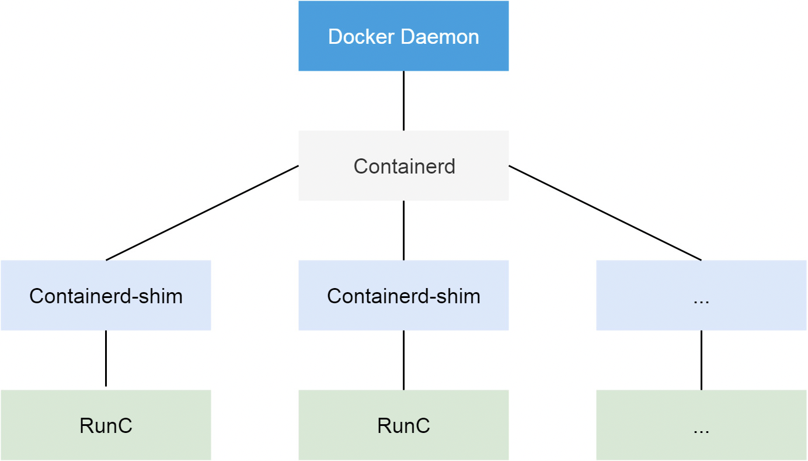

# 容器运行时
在学习 Containerd 之前我们有必要对 Docker 的发展历史做一个简单的回顾，因为这里面牵涉到的组件实战是有点多，有很多我们会经常听到，但是不清楚这些组件到底是干什么用的，比如 <ins class="critic">libcontainer、runc、containerd、CRI、OCI</ins> 等等。

## Docker
从 Docker 1.11 版本开始，Docker 容器运行就不是简单通过 Docker Daemon 来启动了，而是通过集成 containerd、runc 等多个组件来完成的。虽然 Docker Daemon 守护进程模块在不停的重构，但是基本功能和定位没有太大的变化，一直都是 CS 架构，守护进程负责和 Docker Client 端交互，并管理 Docker 镜像和容器。现在的架构中组件 containerd 就会负责集群节点上容器的生命周期管理，并向上为 Docker Daemon 提供 gRPC 接口。

