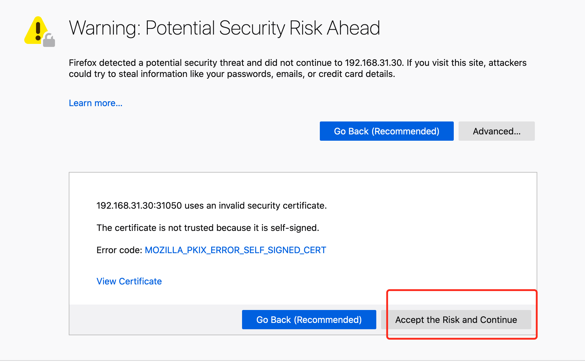
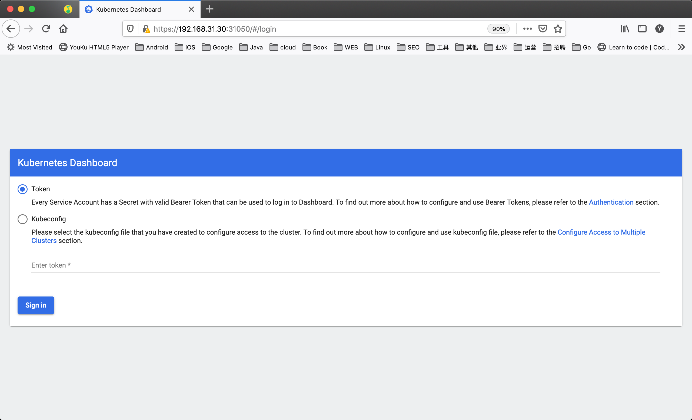

# 集群部署

**使用 containerd 作为容器运行时搭建 Kubernetes 集群**

现在我们使用 kubeadm 从头搭建一个使用 containerd 作为容器运行时的 Kubernetes 集群，这里我们安装最新的 `v1.22.2` 版本。

## 环境准备
3个节点，都是 Centos 7.6 系统，内核版本：3.10.0-1062.4.1.el7.x86_64，在每个节点上添加 hosts 信息：
``` bash
➜  ~ cat /etc/hosts
192.168.0.186 k8sm
192.168.0.187 k8sn1
192.168.0.188 k8sn2
```

!!! WARNING "hostname"
	节点的 hostname 必须使用标准的 DNS 命名，另外千万不用什么默认的 `localhost` 的 hostname，会导致各种错误出现的。在 Kubernetes 项目里，机器的名字以及一切存储在 Etcd 中的 API 对象，都必须使用标准的 DNS 命名（RFC 1123）。可以使用命令 `hostnamectl set-hostname node1` 来修改 hostname。

禁用防火墙：

``` bash
➜  ~ systemctl stop firewalld
➜  ~ systemctl disable firewalld
```

禁用 SELINUX：

``` bash
➜  ~ setenforce 0
➜  ~ cat /etc/selinux/config
SELINUX=disabled
```

由于开启内核 ipv4 转发需要加载 br_netfilter 模块，所以加载下该模块：

``` bash
➜  ~ modprobe br_netfilter
```

创建`/etc/sysctl.d/k8s.conf`文件，添加如下内容：

``` bash
net.bridge.bridge-nf-call-ip6tables = 1
net.bridge.bridge-nf-call-iptables = 1
net.ipv4.ip_forward = 1
```

!!! INFO "bridge-nf"
	bridge-nf 使得 netfilter 可以对 Linux 网桥上的 IPv4/ARP/IPv6 包过滤。比如，设置`net.bridge.bridge-nf-call-iptables＝1`后，二层的网桥在转发包时也会被 iptables的 FORWARD 规则所过滤。常用的选项包括：

    - net.bridge.bridge-nf-call-arptables：是否在 arptables 的 FORWARD 中过滤网桥的 ARP 包
    - net.bridge.bridge-nf-call-ip6tables：是否在 ip6tables 链中过滤 IPv6 包
    - net.bridge.bridge-nf-call-iptables：是否在 iptables 链中过滤 IPv4 包
    - net.bridge.bridge-nf-filter-vlan-tagged：是否在 iptables/arptables 中过滤打了 vlan 标签的包。

执行如下命令使修改生效：

```bash
➜  ~ sysctl -p /etc/sysctl.d/k8s.conf
```

安装 ipvs：
``` bash
➜  ~ cat > /etc/sysconfig/modules/ipvs.modules <<EOF
#!/bin/bash
modprobe -- ip_vs
modprobe -- ip_vs_rr
modprobe -- ip_vs_wrr
modprobe -- ip_vs_sh
modprobe -- nf_conntrack_ipv4
EOF
➜  ~ chmod 755 /etc/sysconfig/modules/ipvs.modules && bash /etc/sysconfig/modules/ipvs.modules && lsmod | grep -e ip_vs -e nf_conntrack_ipv4
```
上面脚本创建了的`/etc/sysconfig/modules/ipvs.modules`文件，保证在节点重启后能自动加载所需模块。使用`lsmod | grep -e ip_vs -e nf_conntrack_ipv4`命令查看是否已经正确加载所需的内核模块。
接下来还需要确保各个节点上已经安装了 ipset 软件包：
``` bash
➜  ~ yum install ipset
```
为了便于查看 ipvs 的代理规则，最好安装一下管理工具 ipvsadm：
``` bash
➜  ~ yum install ipvsadm
```
同步服务器时间
``` bash
➜  ~ yum install chrony -y
➜  ~ systemctl enable chronyd
➜  ~ systemctl start chronyd
➜  ~ chronyc sources
210 Number of sources = 4
MS Name/IP address         Stratum Poll Reach LastRx Last sample
===============================================================================
^+ sv1.ggsrv.de                  2   6    17    32   -823us[-1128us] +/-   98ms
^- montreal.ca.logiplex.net      2   6    17    32    -17ms[  -17ms] +/-  179ms
^- ntp6.flashdance.cx            2   6    17    32    -32ms[  -32ms] +/-  161ms
^* 119.28.183.184                2   6    33    32   +661us[ +357us] +/-   38ms
➜  ~ date
Tue Aug 31 14:36:14 CST 2021
```
关闭 swap 分区：
``` bash
➜  ~ swapoff -a
```
修改`/etc/fstab`文件，注释掉 SWAP 的自动挂载，使用free -m确认 swap 已经关闭。swappiness 参数调整，修改`/etc/sysctl.d/k8s.conf`添加下面一行：
``` bash
vm.swappiness=0
```
执行 `sysctl -p /etc/sysctl.d/k8s.conf` 使修改生效。

## 安装 Containerd
我们已经了解过容器运行时 containerd 的一些基本使用，接下来在各个节点上安装 Containerd。

由于 containerd 需要调用 runc，所以我们也需要先安装 runc，不过 containerd 提供了一个包含相关依赖的压缩包 `cri-containerd-cni-${VERSION}.${OS}-${ARCH}.tar.gz`，可以直接使用这个包来进行安装。首先从 [release](https://github.com/containerd/containerd/releases) 页面下载最新版本的压缩包，当前为 1.5.5 版本：
``` bash
➜  ~ wget https://github.com/containerd/containerd/releases/download/v1.5.5/cri-containerd-cni-1.5.5-linux-amd64.tar.gz
# 如果有限制，也可以替换成下面的 URL 加速下载
# wget https://download.fastgit.org/containerd/containerd/releases/download/v1.5.5/cri-containerd-cni-1.5.5-linux-amd64.tar.gz
```
直接将压缩包解压到系统的各个目录中：
``` bash
➜  ~ tar -C / -xzf cri-containerd-cni-1.5.5-linux-amd64.tar.gz
```
然后要将 `/usr/local/bin` 和 `/usr/local/sbin` 追加到 `~/.bashrc` 文件的 `PATH` 环境变量中：
``` bash
export PATH=$PATH:/usr/local/bin:/usr/local/sbin
```
然后执行下面的命令使其立即生效：
``` bash
➜  ~ source ~/.bashrc
```
containerd 的默认配置文件为 `/etc/containerd/config.toml`，我们可以通过如下所示的命令生成一个默认的配置：
``` bash
➜  ~ mkdir -p /etc/containerd
➜  ~ containerd config default > /etc/containerd/config.toml
```
对于使用 systemd 作为 init system 的 Linux 的发行版，使用 `systemd` 作为容器的 `cgroup driver` 可以确保节点在资源紧张的情况更加稳定，所以推荐将 containerd 的 cgroup driver 配置为 systemd。

修改前面生成的配置文件 `/etc/containerd/config.toml`，在 `plugins."io.containerd.grpc.v1.cri".containerd.runtimes.runc.options` 配置块下面将 `SystemdCgroup` 设置为 `true`：
``` toml
[plugins."io.containerd.grpc.v1.cri".containerd.runtimes.runc]
  ...
  [plugins."io.containerd.grpc.v1.cri".containerd.runtimes.runc.options]
    SystemdCgroup = true
    ....
```
然后再为镜像仓库配置一个加速器，需要在 cri 配置块下面的 `registry` 配置块下面进行配置 `registry.mirrors`：
``` toml
[plugins."io.containerd.grpc.v1.cri"]
  ...
  # sandbox_image = "k8s.gcr.io/pause:3.5"
  sandbox_image = "registry.aliyuncs.com/k8sxio/pause:3.5"
  ...
  [plugins."io.containerd.grpc.v1.cri".registry]
    [plugins."io.containerd.grpc.v1.cri".registry.mirrors]
      [plugins."io.containerd.grpc.v1.cri".registry.mirrors."docker.io"]
        endpoint = ["https://bqr1dr1n.mirror.aliyuncs.com"]
      [plugins."io.containerd.grpc.v1.cri".registry.mirrors."k8s.gcr.io"]
        endpoint = ["https://registry.aliyuncs.com/k8sxio"]
```
!!! WARNING
	如果我们的节点不能正常获取 `k8s.gcr.io` 的镜像，那么我们需要在上面重新配置 `sandbox_image` 镜像，否则后面 kubelet 覆盖该镜像不会生效：`Warning: For remote container runtime, --pod-infra-container-image is ignored in kubelet, which should be set in that remote runtime instead。`

由于上面我们下载的 containerd 压缩包中包含一个 `etc/systemd/system/containerd.service` 的文件，这样我们就可以通过 systemd 来配置 containerd 作为守护进程运行了，现在我们就可以启动 containerd 了，直接执行下面的命令即可：
``` bash
➜  ~ systemctl daemon-reload
➜  ~ systemctl enable containerd --now
```
启动完成后就可以使用 containerd 的本地 CLI 工具 `ctr` 和 `crictl` 了，比如查看版本：
``` bash
➜  ~ ctr version
Client:
  Version:  v1.5.5
  Revision: 72cec4be58a9eb6b2910f5d10f1c01ca47d231c0
  Go version: go1.16.6

Server:
  Version:  v1.5.5
  Revision: 72cec4be58a9eb6b2910f5d10f1c01ca47d231c0
  UUID: cd2894ad-fd71-4ef7-a09f-5795c7eb4c3b
➜  ~ crictl version
Version:  0.1.0
RuntimeName:  containerd
RuntimeVersion:  v1.5.5
RuntimeApiVersion:  v1alpha2
```

### 使用 kubeadm 部署 Kubernetes

上面的相关环境配置也完成了，现在我们就可以来安装 Kubeadm 了，我们这里是通过指定yum 源的方式来进行安装的：
``` bash
➜  ~ cat <<EOF > /etc/yum.repos.d/kubernetes.repo
[kubernetes]
name=Kubernetes
baseurl=https://packages.cloud.google.com/yum/repos/kubernetes-el7-x86_64
enabled=1
gpgcheck=1
repo_gpgcheck=1
gpgkey=https://packages.cloud.google.com/yum/doc/yum-key.gpg
        https://packages.cloud.google.com/yum/doc/rpm-package-key.gpg
EOF
```
当然了，上面的 yum 源是需要科学上网的，如果不能科学上网的话，我们可以使用阿里云的源进行安装：
``` bash
➜  ~ cat <<EOF > /etc/yum.repos.d/kubernetes.repo
[kubernetes]
name=Kubernetes
baseurl=http://mirrors.aliyun.com/kubernetes/yum/repos/kubernetes-el7-x86_64
enabled=1
gpgcheck=0
repo_gpgcheck=0
gpgkey=http://mirrors.aliyun.com/kubernetes/yum/doc/yum-key.gpg
        http://mirrors.aliyun.com/kubernetes/yum/doc/rpm-package-key.gpg
EOF
```
然后安装 kubeadm、kubelet、kubectl：
``` bash
# --disableexcludes 禁掉除了kubernetes之外的别的仓库
➜  ~ yum makecache fast
➜  ~ yum install -y kubelet-1.22.2 kubeadm-1.22.2 kubectl-1.22.2 --disableexcludes=kubernetes
➜  ~ kubeadm version
kubeadm version: &version.Info{Major:"1", Minor:"22", GitVersion:"v1.22.2", GitCommit:"8b5a19147530eaac9476b0ab82980b4088bbc1b2", GitTreeState:"clean", BuildDate:"2021-09-15T21:37:34Z", GoVersion:"go1.16.8", Compiler:"gc", Platform:"linux/amd64"}
```
可以看到我们这里安装的是 `v1.22.2` 版本，然后将 master 节点的 kubelet 设置成开机启动：
``` bash
➜  ~ systemctl enable --now kubelet
```
!!! SUCCESS
	到这里为止上面所有的操作都需要在所有节点执行配置。

### 初始化集群
当我们执行 `kubelet --help` 命令的时候可以看到原来大部分命令行参数都被 `DEPRECATED`了，这是因为官方推荐我们使用 `--config` 来指定配置文件，在配置文件中指定原来这些参数的配置，可以通过官方文档 [Set Kubelet parameters via a config file](https://kubernetes.io/docs/tasks/administer-cluster/kubelet-config-file/) 了解更多相关信息，这样 Kubernetes 就可以支持动态 Kubelet 配置（Dynamic Kubelet Configuration）了，参考 [Reconfigure a Node’s Kubelet in a Live Cluster](https://kubernetes.io/docs/tasks/administer-cluster/reconfigure-kubelet/)。

然后我们可以通过下面的命令在 master 节点上输出集群初始化默认使用的配置：
``` bash
➜  ~ kubeadm config print init-defaults --component-configs KubeletConfiguration > kubeadm.yaml
```
然后根据我们自己的需求修改配置，比如修改 `imageRepository` 指定集群初始化时拉取 Kubernetes 所需镜像的地址，kube-proxy 的模式为 ipvs，另外需要注意的是我们这里是准备安装 flannel 网络插件的，需要将 `networking.podSubnet` 设置为<span class="jade">`10.244.0.0/16`</span>：
``` yaml
# kubeadm.yaml
apiVersion: kubeadm.k8s.io/v1beta3
bootstrapTokens:
- groups:
  - system:bootstrappers:kubeadm:default-node-token
  token: abcdef.0123456789abcdef
  ttl: 24h0m0s
  usages:
  - signing
  - authentication
kind: InitConfiguration
localAPIEndpoint:
  advertiseAddress: 192.168.0.186  # 指定master节点内网IP
  bindPort: 6443
nodeRegistration:
  criSocket: /run/containerd/containerd.sock  # 使用 containerd的Unix socket 地址
  imagePullPolicy: IfNotPresent
  name: master
  taints:  # 给master添加污点，master节点不能调度应用
  - effect: "NoSchedule"
    key: "node-role.kubernetes.io/master"

---
apiVersion: kubeproxy.config.k8s.io/v1alpha1
kind: KubeProxyConfiguration
mode: ipvs  # kube-proxy 模式

---
apiServer:
  timeoutForControlPlane: 4m0s
apiVersion: kubeadm.k8s.io/v1beta3
certificatesDir: /etc/kubernetes/pki
clusterName: kubernetes
controllerManager: {}
dns: {}
etcd:
  local:
    dataDir: /var/lib/etcd
imageRepository: registry.aliyuncs.com/k8sxio
kind: ClusterConfiguration
kubernetesVersion: 1.22.2
networking:
  dnsDomain: cluster.local
  serviceSubnet: 10.96.0.0/12
  podSubnet: 10.244.0.0/16  # 指定 pod 子网
scheduler: {}

---
apiVersion: kubelet.config.k8s.io/v1beta1
authentication:
  anonymous:
    enabled: false
  webhook:
    cacheTTL: 0s
    enabled: true
  x509:
    clientCAFile: /etc/kubernetes/pki/ca.crt
authorization:
  mode: Webhook
  webhook:
    cacheAuthorizedTTL: 0s
    cacheUnauthorizedTTL: 0s
clusterDNS:
- 10.96.0.10
clusterDomain: cluster.local
cpuManagerReconcilePeriod: 0s
evictionPressureTransitionPeriod: 0s
fileCheckFrequency: 0s
healthzBindAddress: 127.0.0.1
healthzPort: 10248
httpCheckFrequency: 0s
imageMinimumGCAge: 0s
kind: KubeletConfiguration
cgroupDriver: systemd  # 配置 cgroup driver
logging: {}
memorySwap: {}
nodeStatusReportFrequency: 0s
nodeStatusUpdateFrequency: 0s
rotateCertificates: true
runtimeRequestTimeout: 0s
shutdownGracePeriod: 0s
shutdownGracePeriodCriticalPods: 0s
staticPodPath: /etc/kubernetes/manifests
streamingConnectionIdleTimeout: 0s
syncFrequency: 0s
volumeStatsAggPeriod: 0s
```
!!! TIP "配置提示"
	对于上面的资源清单的文档比较杂，要想完整了解上面的资源对象对应的属性，可以查看对应的 godoc 文档，地址: https://godoc.org/k8s.io/kubernetes/cmd/kubeadm/app/apis/kubeadm/v1beta3。

在开始初始化集群之前可以使用 `kubeadm config images pull --config kubeadm.yaml` 预先在各个服务器节点上拉取所k8s需要的容器镜像。

配置文件准备好过后，可以使用如下命令先将相关镜像 pull 下面：
``` bash
➜  ~ kubeadm config images pull --config kubeadm.yaml
[config/images] Pulled registry.aliyuncs.com/k8sxio/kube-apiserver:v1.22.2
[config/images] Pulled registry.aliyuncs.com/k8sxio/kube-controller-manager:v1.22.2
[config/images] Pulled registry.aliyuncs.com/k8sxio/kube-scheduler:v1.22.2
[config/images] Pulled registry.aliyuncs.com/k8sxio/kube-proxy:v1.22.2
[config/images] Pulled registry.aliyuncs.com/k8sxio/pause:3.5
[config/images] Pulled registry.aliyuncs.com/k8sxio/etcd:3.5.0-0
failed to pull image "registry.aliyuncs.com/k8sxio/coredns:v1.8.4": output: time="2021-10-25T17:34:48+08:00" level=fatal msg="pulling image: rpc error: code = NotFound desc = failed to pull and unpack image \"registry.aliyuncs.com/k8sxio/coredns:v1.8.4\": failed to resolve reference \"registry.aliyuncs.com/k8sxio/coredns:v1.8.4\": registry.aliyuncs.com/k8sxio/coredns:v1.8.4: not found"
, error: exit status 1
To see the stack trace of this error execute with --v=5 or higher
```
上面在拉取 `coredns` 镜像的时候出错了，没有找到这个镜像，我们可以手动 pull 该镜像，然后重新 tag 下镜像地址即可：
``` bash
➜  ~ ctr -n k8s.io i pull docker.io/coredns/coredns:1.8.4
docker.io/coredns/coredns:1.8.4:                                                  resolved       |++++++++++++++++++++++++++++++++++++++|
index-sha256:6e5a02c21641597998b4be7cb5eb1e7b02c0d8d23cce4dd09f4682d463798890:    done           |++++++++++++++++++++++++++++++++++++++|
manifest-sha256:10683d82b024a58cc248c468c2632f9d1b260500f7cd9bb8e73f751048d7d6d4: done           |++++++++++++++++++++++++++++++++++++++|
layer-sha256:bc38a22c706b427217bcbd1a7ac7c8873e75efdd0e59d6b9f069b4b243db4b4b:    done           |++++++++++++++++++++++++++++++++++++++|
config-sha256:8d147537fb7d1ac8895da4d55a5e53621949981e2e6460976dae812f83d84a44:   done           |++++++++++++++++++++++++++++++++++++++|
layer-sha256:c6568d217a0023041ef9f729e8836b19f863bcdb612bb3a329ebc165539f5a80:    exists         |++++++++++++++++++++++++++++++++++++++|
elapsed: 12.4s                                                                    total:  12.0 M (991.3 KiB/s)
unpacking linux/amd64 sha256:6e5a02c21641597998b4be7cb5eb1e7b02c0d8d23cce4dd09f4682d463798890...
done: 410.185888ms
➜  ~ ctr -n k8s.io i tag docker.io/coredns/coredns:1.8.4 registry.aliyuncs.com/k8sxio/coredns:v1.8.4
```
然后就可以使用上面的配置文件在 master 节点上进行初始化：
``` bash
➜  ~ kubeadm init --config kubeadm.yaml --v=5
[init] Using Kubernetes version: v1.22.2
[preflight] Running pre-flight checks
[preflight] Pulling images required for setting up a Kubernetes cluster
[preflight] This might take a minute or two, depending on the speed of your internet connection
[preflight] You can also perform this action in beforehand using 'kubeadm config images pull'
[certs] Using certificateDir folder "/etc/kubernetes/pki"
[certs] Generating "ca" certificate and key
[certs] Generating "apiserver" certificate and key
[certs] apiserver serving cert is signed for DNS names [kubernetes kubernetes.default kubernetes.default.svc kubernetes.default.svc.cluster.local master1] and IPs [10.96.0.1 192.168.31.31]
[certs] Generating "apiserver-kubelet-client" certificate and key
[certs] Generating "front-proxy-ca" certificate and key
[certs] Generating "front-proxy-client" certificate and key
[certs] Generating "etcd/ca" certificate and key
[certs] Generating "etcd/server" certificate and key
[certs] etcd/server serving cert is signed for DNS names [localhost master1] and IPs [192.168.31.31 127.0.0.1 ::1]
[certs] Generating "etcd/peer" certificate and key
[certs] etcd/peer serving cert is signed for DNS names [localhost master1] and IPs [192.168.31.31 127.0.0.1 ::1]
[certs] Generating "etcd/healthcheck-client" certificate and key
[certs] Generating "apiserver-etcd-client" certificate and key
[certs] Generating "sa" key and public key
[kubeconfig] Using kubeconfig folder "/etc/kubernetes"
[kubeconfig] Writing "admin.conf" kubeconfig file
[kubeconfig] Writing "kubelet.conf" kubeconfig file
[kubeconfig] Writing "controller-manager.conf" kubeconfig file
[kubeconfig] Writing "scheduler.conf" kubeconfig file
[kubelet-start] Writing kubelet environment file with flags to file "/var/lib/kubelet/kubeadm-flags.env"
[kubelet-start] Writing kubelet configuration to file "/var/lib/kubelet/config.yaml"
[kubelet-start] Starting the kubelet
[control-plane] Using manifest folder "/etc/kubernetes/manifests"
[control-plane] Creating static Pod manifest for "kube-apiserver"
[control-plane] Creating static Pod manifest for "kube-controller-manager"
[control-plane] Creating static Pod manifest for "kube-scheduler"
[etcd] Creating static Pod manifest for local etcd in "/etc/kubernetes/manifests"
[wait-control-plane] Waiting for the kubelet to boot up the control plane as static Pods from directory "/etc/kubernetes/manifests". This can take up to 4m0s
[apiclient] All control plane components are healthy after 12.004224 seconds
[upload-config] Storing the configuration used in ConfigMap "kubeadm-config" in the "kube-system" Namespace
[kubelet] Creating a ConfigMap "kubelet-config-1.22" in namespace kube-system with the configuration for the kubelets in the cluster
[upload-certs] Skipping phase. Please see --upload-certs
[mark-control-plane] Marking the node master1 as control-plane by adding the labels: [node-role.kubernetes.io/master(deprecated) node-role.kubernetes.io/control-plane node.kubernetes.io/exclude-from-external-load-balancers]
[mark-control-plane] Marking the node master1 as control-plane by adding the taints [node-role.kubernetes.io/master:NoSchedule]
[bootstrap-token] Using token: abcdef.0123456789abcdef
[bootstrap-token] Configuring bootstrap tokens, cluster-info ConfigMap, RBAC Roles
[bootstrap-token] configured RBAC rules to allow Node Bootstrap tokens to get nodes
[bootstrap-token] configured RBAC rules to allow Node Bootstrap tokens to post CSRs in order for nodes to get long term certificate credentials
[bootstrap-token] configured RBAC rules to allow the csrapprover controller automatically approve CSRs from a Node Bootstrap Token
[bootstrap-token] configured RBAC rules to allow certificate rotation for all node client certificates in the cluster
[bootstrap-token] Creating the "cluster-info" ConfigMap in the "kube-public" namespace
[kubelet-finalize] Updating "/etc/kubernetes/kubelet.conf" to point to a rotatable kubelet client certificate and key
[addons] Applied essential addon: CoreDNS
[addons] Applied essential addon: kube-proxy

Your Kubernetes control-plane has initialized successfully!

To start using your cluster, you need to run the following as a regular user:

  mkdir -p $HOME/.kube
  sudo cp -i /etc/kubernetes/admin.conf $HOME/.kube/config
  sudo chown $(id -u):$(id -g) $HOME/.kube/config

Alternatively, if you are the root user, you can run:

  export KUBECONFIG=/etc/kubernetes/admin.conf

You should now deploy a pod network to the cluster.
Run "kubectl apply -f [podnetwork].yaml" with one of the options listed at:
  https://kubernetes.io/docs/concepts/cluster-administration/addons/

Then you can join any number of worker nodes by running the following on each as root:

kubeadm join 192.168.0.186:6443 --token abcdef.0123456789abcdef \
    --discovery-token-ca-cert-hash sha256:ca0c87226c69309d7779096c15b6a41e14b077baf4650bfdb6f9d3178d4da645
```
根据安装提示拷贝 kubeconfig 文件：
``` bash
➜  ~ mkdir -p $HOME/.kube
➜  ~ sudo cp -i /etc/kubernetes/admin.conf $HOME/.kube/config
➜  ~ sudo chown $(id -u):$(id -g) $HOME/.kube/config
```
然后可以使用 kubectl 命令查看 master 节点已经初始化成功了：
``` bash
➜  ~ kubectl get nodes
NAME      STATUS   ROLES                  AGE   VERSION
k8sm   Ready    control-plane,master   41s   v1.22.2
```

### 添加节点
记住初始化集群上面的配置和操作要提前做好，将 master 节点上面的 `$HOME/.kube/config` 文件拷贝到 node 节点对应的文件中，安装 kubeadm、kubelet、kubectl（可选），然后执行上面初始化完成后提示的 join 命令即可：
``` bash
➜  ~ kubeadm join 192.168.31.31:6443 --token abcdef.0123456789abcdef \
> --discovery-token-ca-cert-hash sha256:ca0c87226c69309d7779096c15b6a41e14b077baf4650bfdb6f9d3178d4da645
[preflight] Running pre-flight checks
[preflight] Reading configuration from the cluster...
[preflight] FYI: You can look at this config file with 'kubectl -n kube-system get cm kubeadm-config -o yaml'
[kubelet-start] Writing kubelet configuration to file "/var/lib/kubelet/config.yaml"
[kubelet-start] Writing kubelet environment file with flags to file "/var/lib/kubelet/kubeadm-flags.env"
[kubelet-start] Starting the kubelet
[kubelet-start] Waiting for the kubelet to perform the TLS Bootstrap...

This node has joined the cluster:
* Certificate signing request was sent to apiserver and a response was received.
* The Kubelet was informed of the new secure connection details.

Run 'kubectl get nodes' on the control-plane to see this node join the cluster.
```
!!! INFO "join 命令"
	如果忘记了上面的 join 命令可以使用命令 `kubeadm token create --print-join-command` 重新获取。

执行成功后运行 get nodes 命令：
``` bash
➜  ~ kubectl get nodes
NAME      STATUS   ROLES                  AGE     VERSION
k8sm   	  Ready    control-plane,master   2m35s   v1.22.2
k8sn1     Ready    <none>                 45s     v1.22.2
```
这个时候其实集群还不能正常使用，因为还没有安装网络插件，接下来安装网络插件，可以在文档 https://kubernetes.io/docs/setup/production-environment/tools/kubeadm/create-cluster-kubeadm/ 中选择我们自己的网络插件，这里我们安装 flannel:
``` bash
➜  ~ wget https://raw.githubusercontent.com/coreos/flannel/master/Documentation/kube-flannel.yml
# 如果有节点是多网卡，则需要在资源清单文件中指定内网网卡
# 搜索到名为 kube-flannel-ds 的 DaemonSet，在kube-flannel容器下面
➜  ~ vi kube-flannel.yml
......
containers:
- name: kube-flannel
  image: quay.io/coreos/flannel:v0.15.0
  command:
  - /opt/bin/flanneld
  args:
  - --ip-masq
  - --kube-subnet-mgr
  - --iface=eth0  # 如果是多网卡的话，指定内网网卡的名称
......
➜  ~ kubectl apply -f kube-flannel.yml  # 安装 flannel 网络插件
```
隔一会儿查看 Pod 运行状态：
``` bash
➜  ~ kubectl get pods -n kube-system
NAME                             READY   STATUS    RESTARTS   AGE
coredns-7568f67dbd-5mg59         1/1     Running   0          8m32s
coredns-7568f67dbd-b685t         1/1     Running   0          8m31s
etcd-master                      1/1     Running   0          66m
kube-apiserver-master            1/1     Running   0          66m
kube-controller-manager-master   1/1     Running   0          66m
kube-flannel-ds-dsbt6            1/1     Running   0          11m
kube-flannel-ds-zwlm6            1/1     Running   0          11m
kube-proxy-jq84n                 1/1     Running   0          66m
kube-proxy-x4hbv                 1/1     Running   0          19m
kube-scheduler-master            1/1     Running   0          66m
```
!!! WARNING "Flannel 网络插件"
	当我们部署完网络插件后执行 ifconfig 命令，正常会看到新增的`cni0`与`flannel1`这两个虚拟设备，但是如果没有看到`cni0`这个设备也不用太担心，我们可以观察`/var/lib/cni`目录是否存在，如果不存在并不是说部署有问题，而是该节点上暂时还没有应用运行，我们只需要在该节点上运行一个 Pod 就可以看到该目录会被创建，并且`cni0`设备也会被创建出来。

用同样的方法添加另外一个节点即可。

## Dashboard
`v1.22.2` 版本的集群需要安装最新的 2.0+ 版本的 Dashboard：
``` bash
# 推荐使用下面这种方式
➜  ~ wget https://raw.githubusercontent.com/kubernetes/dashboard/v2.3.1/aio/deploy/recommended.yaml
➜  ~ vi recommended.yaml
# 修改Service为NodePort类型
......
kind: Service
apiVersion: v1
metadata:
  labels:
    k8s-app: kubernetes-dashboard
  name: kubernetes-dashboard
  namespace: kubernetes-dashboard
spec:
  ports:
    - port: 443
      targetPort: 8443
  selector:
    k8s-app: kubernetes-dashboard
  type: NodePort  # 加上type=NodePort变成NodePort类型的服务
......
```
!!! INFO "监控组件"
	在 YAML 文件中可以看到新版本 Dashboard 集成了一个 metrics-scraper 的组件，可以通过 Kubernetes 的 Metrics API 收集一些基础资源的监控信息，并在 web 页面上展示，所以要想在页面上展示监控信息就需要提供 Metrics API，比如安装 Metrics Server。

直接创建：
``` bash
➜  ~ kubectl apply -f recommended.yaml
```
新版本的 Dashboard 会被默认安装在 kubernetes-dashboard 这个命名空间下面：
``` bash
➜  ~ kubectl get pods -n kubernetes-dashboard -o wide
NAME                                         READY   STATUS    RESTARTS   AGE   IP          NODE     NOMINATED NODE   READINESS GATES
dashboard-metrics-scraper-856586f554-pllvt   1/1     Running   0          24m   10.88.0.7   k8sm   <none>           <none>
kubernetes-dashboard-76597d7df5-82998        1/1     Running   0          21m   10.88.0.2   k8sn2    <none>           <none>
```
我们仔细看可以发现上面的 Pod 分配的 IP 段是 <span class="jade">`10.88.xx.xx`</span>，包括前面自动安装的 CoreDNS 也是如此，我们前面不是配置的 podSubnet 为 <span class="jade">`10.244.0.0/16`</span> 吗？我们先去查看下 CNI 的配置文件：
``` bash
➜  ~ ls -la /etc/cni/net.d/
total 8
drwxr-xr-x  2 1001 docker  67 Aug 31 16:45 .
drwxr-xr-x. 3 1001 docker  19 Jul 30 01:13 ..
-rw-r--r--  1 1001 docker 604 Jul 30 01:13 10-containerd-net.conflist
-rw-r--r--  1 root root   292 Aug 31 16:45 10-flannel.conflist
```
可以看到里面包含两个配置，一个是 `10-containerd-net.conflist`，另外一个是我们上面创建的 Flannel 网络插件生成的配置，我们的需求肯定是想使用 Flannel 的这个配置，我们可以查看下 containerd 这个自带的 cni 插件配置：
``` bash
➜  ~ cat /etc/cni/net.d/10-containerd-net.conflist
{
  "cniVersion": "0.4.0",
  "name": "containerd-net",
  "plugins": [
    {
      "type": "bridge",
      "bridge": "cni0",
      "isGateway": true,
      "ipMasq": true,
      "promiscMode": true,
      "ipam": {
        "type": "host-local",
        "ranges": [
          [{
            "subnet": "10.88.0.0/16"
          }],
          [{
            "subnet": "2001:4860:4860::/64"
          }]
        ],
        "routes": [
          { "dst": "0.0.0.0/0" },
          { "dst": "::/0" }
        ]
      }
    },
    {
      "type": "portmap",
      "capabilities": {"portMappings": true}
    }
  ]
}
```
可以看到上面的 IP 段恰好就是 <span class="jade">`10.88.0.0/16`</span>，但是这个 cni 插件类型是 `bridge` 网络，网桥的名称为 `cni0`：
``` bash
➜  ~ ip a
...
6: cni0: <BROADCAST,MULTICAST,PROMISC,UP,LOWER_UP> mtu 1500 qdisc noqueue state UP group default qlen 1000
    link/ether 9a:e7:eb:40:e8:66 brd ff:ff:ff:ff:ff:ff
    inet 10.88.0.1/16 brd 10.88.255.255 scope global cni0
       valid_lft forever preferred_lft forever
    inet6 2001:4860:4860::1/64 scope global
       valid_lft forever preferred_lft forever
    inet6 fe80::98e7:ebff:fe40:e866/64 scope link
       valid_lft forever preferred_lft forever
...
```
但是使用 bridge 网络的容器无法跨多个宿主机进行通信，跨主机通信需要借助其他的 cni 插件，比如上面我们安装的 Flannel，或者 Calico 等等，由于我们这里有两个 cni 配置，所以我们需要将 `10-containerd-net.conflist` 这个配置删除，因为如果这个目录中有多个 cni 配置文件，kubelet 将会使用按文件名的字典顺序排列的第一个作为配置文件，所以前面默认选择使用的是 `containerd-net` 这个插件。
``` bash
➜  ~ mv /etc/cni/net.d/10-containerd-net.conflist /etc/cni/net.d/10-containerd-net.conflist.bak
➜  ~ ifconfig cni0 down && ip link delete cni0
➜  ~ systemctl daemon-reload
➜  ~ systemctl restart containerd kubelet
```
然后记得重建 coredns 和 dashboard 的 Pod，重建后 Pod 的 IP 地址就正常了：
``` bash
➜  ~ kubectl get pods -n kubernetes-dashboard -o wide
NAME                                         READY   STATUS    RESTARTS   AGE   IP           NODE    NOMINATED NODE   READINESS GATES
dashboard-metrics-scraper-856586f554-tp8m5   1/1     Running   0          42s   10.244.1.6   k8sn2   <none>           <none>
kubernetes-dashboard-76597d7df5-9rmbx        1/1     Running   0          66s   10.244.1.5   k8sn2   <none>           <none>
➜  ~ kubectl get pods -n kube-system -o wide -l k8s-app=kube-dns
NAME                       READY   STATUS    RESTARTS   AGE     IP           NODE    NOMINATED NODE   READINESS GATES
coredns-7568f67dbd-n7bfx   1/1     Running   0          5m40s   10.244.1.2   k8sn2   <none>           <none>
coredns-7568f67dbd-plrv8   1/1     Running   0          3m47s   10.244.1.4   k8sn2   <none>           <none>
```
查看 Dashboard 的 NodePort 端口：
``` bash
➜  ~ kubectl get svc -n kubernetes-dashboard
NAME                        TYPE        CLUSTER-IP      EXTERNAL-IP   PORT(S)         AGE
dashboard-metrics-scraper   ClusterIP   10.99.37.172    <none>        8000/TCP        25m
kubernetes-dashboard        NodePort    10.103.102.27   <none>        443:31050/TCP   25m
```
然后可以通过上面的 31050 端口去访问 Dashboard，要记住使用 https，Chrome 不生效可以使用Firefox 测试，如果没有 `Firefox` 下面打不开页面，可以点击下页面中的`信任证书`即可：

信任后就可以访问到 Dashboard 的登录页面了：

然后创建一个具有全局所有权限的用户来登录 Dashboard：(admin.yaml)
``` yaml
kind: ClusterRoleBinding
apiVersion: rbac.authorization.k8s.io/v1
metadata:
  name: admin
roleRef:
  kind: ClusterRole
  name: cluster-admin
  apiGroup: rbac.authorization.k8s.io
subjects:
- kind: ServiceAccount
  name: admin
  namespace: kubernetes-dashboard
---
apiVersion: v1
kind: ServiceAccount
metadata:
  name: admin
  namespace: kubernetes-dashboard
```
直接创建：
``` bash
➜  ~ kubectl apply -f admin.yaml
➜  ~ kubectl get secret -n kubernetes-dashboard|grep admin-token
admin-token-lwmmx                  kubernetes.io/service-account-token   3         1d
➜  ~ kubectl get secret admin-token-lwmmx -o jsonpath={.data.token} -n kubernetes-dashboard |base64 -d
# 会生成一串很长的base64后的字符串
```
然后用上面的 base64 解码后的字符串作为 token 登录 Dashboard 即可，新版本还新增了一个暗黑模式：

最终, 我们就完成了使用 kubeadm 搭建 v1.22.2 版本的 kubernetes 集群、coredns、ipvs、flannel、containerd。

## 清理
如果你的集群安装过程中遇到了其他问题，我们可以使用下面的命令来进行重置：
``` bash
➜  ~ kubeadm reset
➜  ~ ifconfig cni0 down && ip link delete cni0
➜  ~ ifconfig flannel.1 down && ip link delete flannel.1
➜  ~ rm -rf /var/lib/cni/
```
